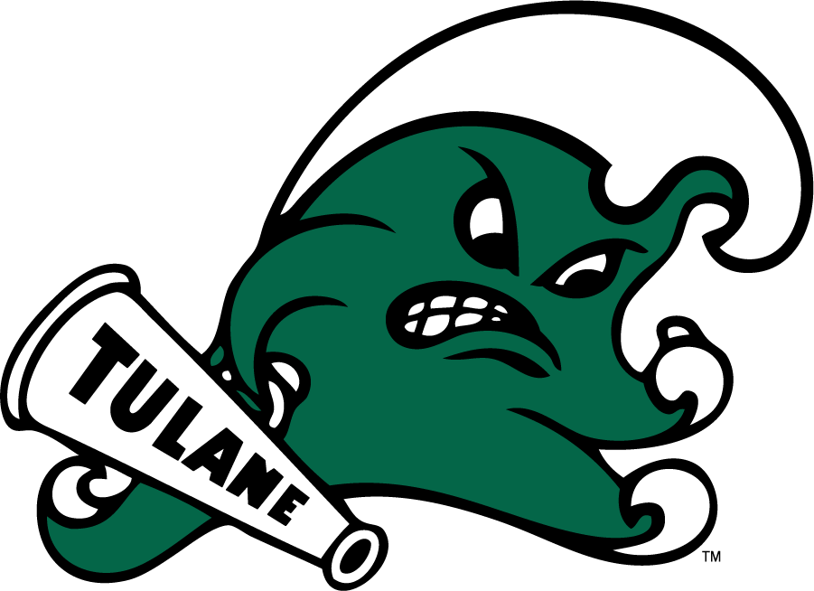

```{r setup, include=FALSE}
library(tufte)
# invalidate cache when the tufte version changes
knitr::opts_chunk$set(cache.extra = packageVersion('tufte'))
options(htmltools.dir.version = FALSE)
```

<span class="marginnote shownote">

</span>

_"The crux of the biscuit is the apostrophe."_ --Frank Zappa


For those wanting all the details, take a look at my [curriculum vitae(CV)](photos/spgarbet-cv.pdf). To contact me decode this puzzle: 'shawn \<dot\> garbett \<at\> vumc.org' or 'shawn \<at\> garbett.org' for personal correspondence.

## Career Highlights

<span class="marginnote shownote">

</span>

I did my undergraduate at Tulane University in New Orleans in electrical engineering and computer science. I worked for several years at TVA and applied combinatorial optimization to coal burning and linear programming to running the reservoir system. The program led to an ~2% increase in coal burn efficiency world wide for multiple furnace installations leading to massive savings--and lower power bills for all.

<span class="marginnote shownote">

</span>

Worked as a consultant for many years, of which the capstone project was working for Air Force One through Walter Reed Hospital. It's a great honor when one's software is part of the Air Force One tooling--and the first closed loop medical device approved by the Food and Drug Administration.

I was hired hired full time in Vanderbilt's Cancer Biology department to create math models of cancer progression and help run an automated microscope. Working with the microscope data, it led me to statistics as the best means to interpret the data for the lab. I discovered a new passion in statistics, and went back and got my masters at Penn State in 2014. This has led me to becoming faculty in [Biostatistics](https://www.vumc.org/biostatistics/vanderbilt-department-biostatistics) at [Vanderbilt University Medical Center](https://www.vumc.org/main/home). I work a fair bit with [Health Policy](https://www.vumc.org/health-policy/welcome-health-policy) on evaluating and optimizing medical treatment decision making. Our working group got a paper in the top 10 genomics papers of the year, three years in a row--an academic hat trick.

<span class="marginnote shownote">

</span>

## The Long and Short of It

I am infinitely curious and highly resourceful. I love playing piano^[_Preciso Me Encontrar_ performed by Buffy Rhea and myself.<audio controls><source src="photos/preciso.mp3" type="audio/mpeg"/>Your browser does not support the audio tag.</audio>], board games, modeling, reading sci fi, and programming. One theme through all these years is modeling--whether it be simulating nuclear magnetic resonance, playing an abstract simulation game or building a scale car and painting it.

Fluent in a wide variety of programming languages and technology stacks. However, what I really enjoy is formally typed languages like Haskell. It's incredible that via the [Curry-Howard correspondence](https://en.wikipedia.org/wiki/Curry%E2%80%93Howard_correspondence) each program is a witness to the proof of that program's type. That type may be something utterly useless and broken, but one has never the less proved it.^[If we only knew what [it](https://youtu.be/5DlTexEXxLQ?si=xy3wOmpC7IJ2_sOg) was.] Dependent type systems of proof via [Homotopy Type Theory](https://homotopytypetheory.org/) is a personal fascination.

If one needs predictive or explanatory statistical data science models^[Currently referred to as artificial intelligence in the press at present.] of data; this I can deliver. Applied economic decision making with dimensions of cost and effectiveness is a specialty.

_Send me your data!_

## Open Source

These are a few of the packages I maintain.

* [redcapAPI](https://github.com/vubiostat/redcapAPI) An R interface to VUMC main data collection platform.
* [emg](https://github.com/spgarbet/emg/) A random mixture distribution function package for R.
* [acepack](https://github.com/vubiostat/acepack) Variance stabilization routines in R. 
* [yaml](https://github.com/vubiostat/r-yaml) A [YAML 1.1](https://yaml.org/spec/1.1/) interface for R. A strong [dependency](https://xkcd.com/2347/) for the modern R community of packages.
* [This website](https://github.com/spgarbet/web)^[Website was made using basic [Markdown hosted on Github](https://www.andreashandel.com/posts/2021-01-11-simple-github-website/index.html) with [Tufte style](https://rstudio.github.io/tufte/).].

