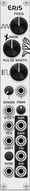
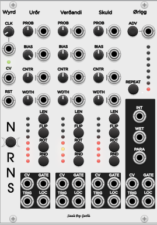
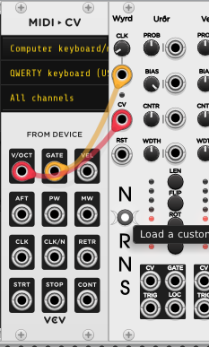
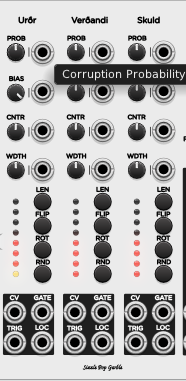
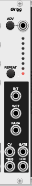
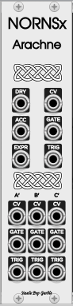

```{r setup, include=FALSE}
library(tufte)
# invalidate cache when the tufte version changes
knitr::opts_chunk$set(cache.extra = packageVersion('tufte'))
options(htmltools.dir.version = FALSE)
```

_"I always wanted to be the least talented member of the band. That way I had to keep up.”_ --Dave Brubeck

Source code available on [github.com](https://github.com/spgarbet/norn/).

# Eris

<span class="marginnote shownote">

</span>

Eris (the Greek god of chaos) is a [VCV Rack](https://vcvrack.com/) VCO with chaotic modulated output. It also features pulse width modulation of all output voices for enhanced timbre choices. The saw wave is modified using a beta function map to approximate the area under the curve to a square PWM wave.

The core idea is that one needs to maintain a periodicity for an oscillator to still be an oscillator. If a logistic map is changing between two values and an output is flipped using this map a square wave results. However, the logistic map goes from 2 values, to 4 values, to 8 values to chaotic unpredictable values. Thus one can parameterize how much chaos via the logistic parameter one wants. This requires some scaling of outputs and this was solved with a lot of simulations and a 4th order curve to normalize the logistic output. There are regions inside the parameter space that are almost stable. 

To truly understand this effect, just hook Eris up to the output and experiment with different levels of chaos via the trim knob. At some higher levels of chaos, listen to the overtone harmonics. Try to find a pattern. About the time it sounds like one has been found it disappears and reappears later like an auditory will-o-the-wisp.

On the surface it sounds like standard bit crushing 8-bit noise being injected. At some values it sounds like a modem screaming out bits of information--there is information in the chaos. The central implementation to all the wave forms is by a chaotic VCA. Releasing a VCA that does given a clock is under consideration as this would allow for the effect to be applied to _any_ VCO.

# Norns


<span class="marginnote shownote">

</span>


Norns is a [VCV Rack](https://vcvrack.com/) module written by [Shawn Garbett](https://www.garbett.org) that provides random sequences and mutates them via Hindustani rhythm theory. There are 3 random sequences (the three Norns) that get woven into a single tapestry that always comes back to 1 on a long downbeat. There are a variety of expression modulations as well that fit within the theory.^[Pelog Scale Raw Demo<br/><audio controls><source src="assets/demo.mp3" type="audio/mpeg"/>Your browser does not support the audio tag.</audio> Demo edited into a track <a href="https://soundcloud.com/shawn-garbett/weave-on-the-run">here</a>.]

NornsEx or Arachne is an expander for Norns that slices across the tapestry woven by the Norns and provides an orthogonal but complementary set of outputs. A weave has 2 directions to form the whole.

Comparable approaches are Euclidean melody generation and [Moog's Labyrinth](https://www.moogmusic.com/synthesizers/labyrinth/). This differs from Euclidean in that the pattern mutations are carefully constructed to come back to 1 _and_ it has expression modulation for position in sequence. Moog's Labyrinth has 2 random sequences going in parallel, whereas this has 3 random sequences getting chopped up in repeating patterns.

A simple example [patch](assets/norns-simple.vcv) is good to play around with to explore what it offers.

## Rhythm Theory

For this exploration the 3 Norns will be referred to as $A$, $B$ and $C$. 

The essential pattern followed is:

$$ABAC$$

The $A$ pattern repeats twice and the $C$ pattern is the "hook" that brings it back to 1. In the classical Hindustani theory the $C$ section should not mutate and provide a clear contrast to $A$ and $B$, rhythmically or harmonically. The $ABA$ section is where the improv happens. However, a good improv needs space and doubling keeps us coming back to 1, thus the essential pattern becomes:

$$ABAcabAC$$

Notice the introduction of lower case into the pattern. This is the back side of the clock (Khali Vibhag), or the unstressed. This is where the bass bayan drum of tabla would drop out and be replaced with dry strokes and the volume reduced.

With another doubling a simple  variation is possible:

$$ABAAABAcabaaABAC$$

Essentially $ABAA$ becomes an initial improv with the standard outro of $ABAC$. The next pattern does the same with $ABBB$ as an initial improv. Some maths are required to get the beats to balance out to come back on 1 if $A$ and $B$ are not the same length. Further variations are achieved by slicing up $A$ and $B$ and shuffling them about during the variational sections. 

The final or 8th pattern is a tihai, or cycle of 3 over the 2. The first beat of $A$ we will designate as "0" and introduce a new letter "K" as a break. 

$$ABAC0-K-ABAC0-K-ABAC$$

This pattern presents the original pattern 3 times and the final "0" comes in on 1, starting the original pattern back on the downbeat. This provides an interesting final variation. 

The important take away is the variation cycle always comes back to 1, the $C$ section is the auditory hook signally return to 1 and the first note of $A$ becomes the all important "1" of the pattern. 

Hindustani rhythm is far more complicated than this short outline (please don't email me complaints about how this overlooked something because it is way short of the true rich complexity of the full tradition), but there are some elements implemented in this module. There is no attempt to fix an exact tal of any form, but rather it relies on random variation to make unique and new tals that _resemble_ the rules of Hindustani theory.

## Norns Details

### Wyrd

<span class="marginnote shownote">

</span>

Wyrd is the fate, from a root word meaning 'to twist'. Here one can use the trim pot to set the BPM of the clock or insert an external clock. The green led turns green on the first half of any clock phase.

The CV input is used at anytime a CV value is needed for a random value. If nothing is connected the internal random is a uniform variable in the range [0,1]. The CV range of -5V to 5V is scaled down to [0,1] for internal storage. All sequence values are stored as [0,1] and only scaled into output values at time of voltage setting. More on this in the Norn section.

The RST input is a reset trigger that resets the internal sequence position to the very first step. This is good for coordinating with external clocks.


Below this is the Norns logo, and the 'O' is a button that triggers an external load of values into the sequence. It will load a value with each rising gate trigger. The button will light up when the unit is in loading mode. Up to a 128 custom CV values can be input for later random selection via the unit as a custom scale. The exact values are also assigned sequentially to each part of the currently active Norns sequences. 

### Urðr, Verðandi, and Skuld

<span class="marginnote shownote">

</span>

Each of the 3 Norn sections weave a single thread, the beginning, the middle and the end. 

The first stop is the PROB (probability) of a random draw when a step is active in this section. 
If the probability is negative, the state of a step does not flip on/off. If the probability is positive, then there is a chance that the state of a step will flip between on/off as well.

The BIAS section controls the bias towards being on when a positive probability triggers a random update for a value. At the center upright position of 0.5, this means that on and off are a coin toss. There is no absolute on or absolute off as the draws are just the bias of a heavily weighted coin. It's been adjusted towards a bias of 1.0 being near 99% chance of being on. 

The next two knob/inputs CNTR (center) and WDTH (width) do _not_ affect any random draws. The internal value is [0,1]. These two parameters affect how that value is scaled into an output CV. Thus if these knobs are changed (or the scale), the internal values are not updated--just the how the output is generated. An example use would be to have the first Norn be a bit below 0.5 for center, the second be 0.5 for center and the last be above 0.5 for center. Thus a progression would tend to go upward as it builds back towards 1. This allows for some harmonic contouring of a pattern.

The middle part of a norn, shows the current state of the pattern via 8 leds and has 4 buttons to manipulate a pattern.

The LEN (length) button changes the length of a pattern from 1-8.

The FLIP button flips the on/off value of the first (bottom) note of a pattern.

The ROT (rotate) button rotates all the values and on/off states down with the bottom or first
rotating to the top value of the pattern.

The RND (randomize) button does a random draw for every active value of a pattern ignoring the PROB value (i.e. the probability is automatically triggered), but respects the BIAS for on/off draws.

LEDs color has the following meanings:

* black: _inactive_ not part of pattern. See LEN above.
* red: This bit is on as part of the pattern.
* yellow: This bit is on and is the currently active note output from the sequencer.
* blue: This bit is off. CV will be the last red light value encountered.
* cyan: The bit is off and is the currently active note in the sequencer.

There are 4 outputs:

* CV: The current control voltage for this section. If the sequencer is off in another section or the current bit is off, it outputs the last CV it encounted _in this section_.
* GATE: This is on if _this section_ is currently active in the woven pattern.
* TRIG: A trigger when an on note is encountered in this section.
* LOC: A modulation output (0-10V) that is a scaled value indicating where in the pattern the last on bit was encountered in this section.

### ørlǫg 

<span class="marginnote shownote">

</span>

Wyrd was the beat that was spun into threads. Norns spun the threads. ørlǫg is pattern built from the threads.

The red led shows which pattern is active, starting with $ABAC$ at the bottom. The advance button requests an advance at the next downbeat of a pattern. A second press immediately advances. This can be also triggered externally.

The REPEAT button controls the number of repeats from 0-6 before the pattern advances to the next. If the top LED is the REPEAT, then it will stay on a pattern until an advance is requested.

INT (intensity) is a modulation source that is 10V at maximum intensity and 0V at minimum intensity of a pattern. It is usually a cosine wave, but _not_ always and can have sudden jumps, especially in the final tihai pattern.

WET (wet) is a modulation source that is like a gate that says whether a pattern should be the wet version. Typically this would indicate bass notes should be triggered for the pattern. This is good for driving a crossfader and selecting between bass and noise sources.

PARA (paradiddle) is a modulation source that is an altenative saw wave based on the clock. It goes Up Up Down Up, Down Down Up Down. A traditional use of this would be to modify a bass note and have it rise or fall base on this source to get that "whoop whoop" sound of a bayan. 
CV This is the note out from the pattern.

GATE is on when a note is active and off when it is note active. It can be used in logic and ANDed with a Norn gate to determine when a note is on in an given section. 

TRIG triggers when a note is triggered.

LOC is location in the full pattern. This is similar to intensity but instead of a cosine wave this is a slowly rising saw. 

## NornsEx / Arachne Details

<span class="marginnote shownote">

</span>

Just having bass notes in the $A$ section and high notes in the $C$ section doesn't really achieve the rhythmic variety that is typical of an Indian tal. The Archane expansion over comes this by rotate the selected note insides a Norn across the other Norns following once again the $ABAC$ pattern. For example, the 1st note of the $A$ thread is the 1st note of the $A$ pattern, but it pulls the 2nd note from the $B$ pattern. If it can't get a note, it rotates into the defined pattern space in case of differing lengths.

In an over generalization, the main Norns module is good for generative melody and the expansion Arachne is better for generative rhythm.

CV, GATE and TRIG are outputs from the new rewoven pattern.

DRY is the NOT of the WET section and is useful for an opposite gate. 

ACC (accent) triggers when beat 1 of a Norn thread triggers.

EXPR is a modified version of INT (intensity) that integrates ACC for the last 10% of intensity giving an accent beat structure modulation.

A', B', and C' are the individual Norn threads rewoven. 

## Advanced Tips

One can utilize multiple scale quantizers from the drop down menu. Try them out and see what fits with your piece. While the output is all relative to 0V CV (i.e relative to C) various VCO's can be tuned up or down to rescale a piece. With some fine tweaking of the width knobs it can take on various modal harmonic variations as well.

Turning off the "Correct Imbalance" allows one to have imbalance patterns (when the length of A does not equal the length of B) where "1" is not on a head pattern. Maybe one just wants such imbalance, but there are further possibilities. One could for example set the length of $A$ and $C$ to be 4 and section $B$ to be 8. Then use the Norn $B$ gate to select a clock cycle that is double the main cycle. This means that the rhythm of the $B$ section would be double (e.g. eights to quarters) that of $A$ and $C$. With imbalance correction turned off, this would come back to one since the patterns are all the same length in time. 

Here's a [kitchen sink](assets/norns-kitchen-sink.vcv) demo module.^[Kitchen Sink Raw Demo<br/><audio controls><source src="assets/demo2.mp3" type="audio/mpeg"/>Your browser does not support the audio tag.</audio>] Remember this is entirely driven by a random sequencer. The kitchen sink tries to have a voice for every output and utilizes most of the modulation sources. 

# Copyright Notice

All music tracks are (c) Copyright 2025 Shawn Garbett. All rights reserved.

Code is copyrighted as GPL-3. 